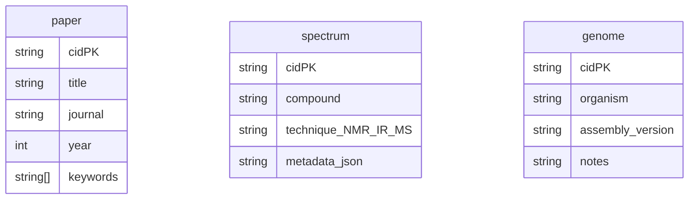
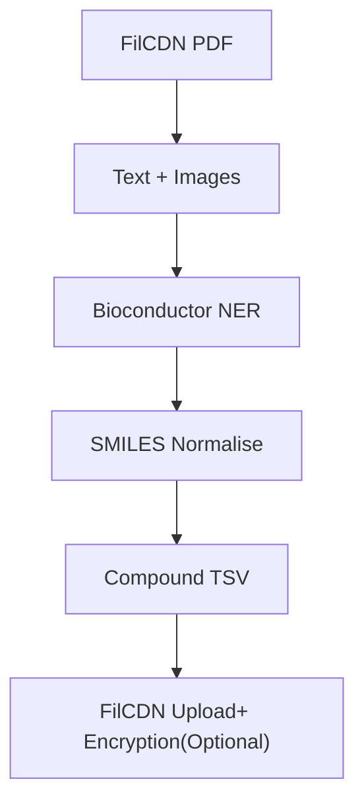
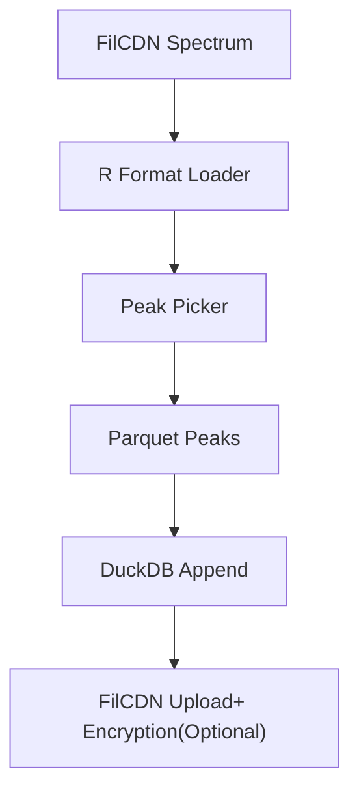
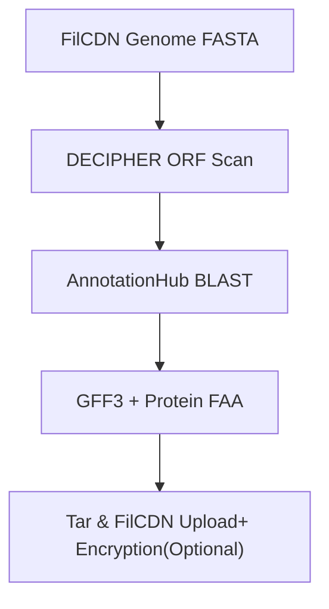
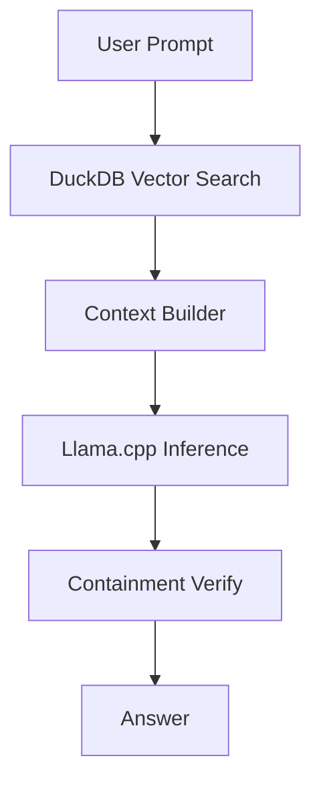
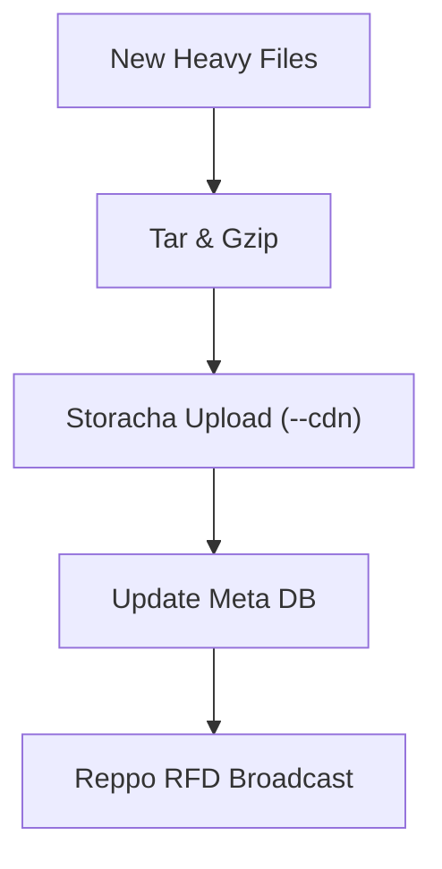

# KintaGen – Lab‑Assistant AI(

**Focus:** biology / science workflows, FilCDN hot‑storage, Mosaic AI agents, optional Flow NFT‑gated decryption.

---

## 1. Data Lifecycle Overview

| Stage                 | Responsibility (placeholder)                                                                                         | Storage target                                     |
| :-------------------- | :------------------------------------------------------------------------------------------------------------------- | :------------------------------------------------- |
| Upload → Encrypt      | `vault-cli encrypt <file>` uses Lit Protocol symmetric key; owner’s Flow address is default decryptor.                | IPFS hot‑storage ➜ FilCDN (`--cdn --pdp=2d`)         |
| Metadata Structuring  | TODO: decide YAML vs. SQLite. Suggested schema: paper, spectrum, genome. Each row → CID + JSON metadata.               | Postgres (Docker) OR simple `metadata.db`          |
| Agent Workflows       | Extraction, analysis, synthesis (see §3).                                                                            | Outputs pinned to IPFS; heavy assets auto‑CDN.       |
| User Access           | Front‑end fetches list via `/api/catalog`; decryption uses Flow NFT sig.                                           | Browser cache                                      |

---

## 2. Data Model (suggested v0.1)



*Placeholder: Swap to Mongo, SurrealDB, or plain JSON if simpler.*

---

## 3. Agent Catalogue

| Agent slug     | Mosaic description (TODO)            | Inputs                   | Heavy outputs (FilCDN)                  |
| :------------- | :----------------------------------- | :----------------------- | :-------------------------------------- |
| `bio-extractor`  | Pulls compounds + SMILES from PDFs.  | paper rows               | Merged TSV of all compounds (bafy…compounds.tsv) |
| `spectra-indexer`| Creates searchable peak lists.       | spectrum rows            | Peak‑index SQLite (~200 MB)             |
| `genome-annot`   | Runs Prokka / BLAST annotations.     | genome rows              | GFF3 + protein FASTA (can be 1 GB)    |
| `qa-answer`      | Llama‑3 RAG answering bio queries.   | paper, spectrum, genome  | Small text answers + citations          |
| `data-publisher` | Batches heavy outputs and uploads to FilCDN (`storacha upload --cdn`). | intermediate artefacts | Public FilCDN URL list                |

---

### 3.1. `bio-extractor` – Detailed Design



**Goal:** Convert raw biology PDFs into structured chemical-entity tables.

**Pipeline Steps:**

1.  Load PDF (FilCDN hot-cached) → raw bytes.
2.  Text layer + images extracted via `pdfminer.six`.
3.  R bridge to Bioconductor:
    *   Uses the `Rcqp` and `tm` packages to run custom chemical NER models.
    *   Calls `ChemmineR::extractSmiles()` to normalise names → canonical SMILES.
4.  Plant-compound enrichment (optional):
    *   If metadata `keywords` contains a Latin species name, query KEGG Plant via Bioconductor’s `KEGGREST` to fetch every reported metabolite for that species → join with PDF-derived list.
5.  Deduplicate & score confidence; output TSV (`compound`, `smiles`, `source_cid`, `confidence`).

**Outputs:**

*   `bafy…compounds.tsv` (pinned, CDN‑enabled) – ready for downstream QA or LLM answering.
*   Logging JSON `extractor_receipt.json` – includes SHA‑256 of input PDF and row count.

**Mosaic Agent YAML (template):**

```yaml
name: bio-extractor
image: ghcr.io/kintagen/bio-extractor:v0.1
memory: 2G
command: ["python", "extract.py", "--input", "%INPUT_PDF%"]
keywords: [chemistry, bioconductor, rdkit]
tags: [extract, compounds]
externalId: pdf_to_compound_agent
```

**Future Ideas:**

*   Add an LC‑MS peak‑matching module that pairs PDF text with actual spectra rows.
*   Push enriched TSVs to Reppo Solver cache for other agents to re‑use.

---

### 3.2. `spectra-indexer` – Detailed Design



**Goal:** Turn raw 1D/2D NMR, IR, and MS files into a searchable peak-index that downstream agents can query.

**Supported Inputs:**

*   Bruker directories (`fid`, `ser`, `acqus`)
*   JCAMP-DX (`.dx`, `.jdx`)
*   mzML / mzXML (LC-MS, GC-MS, HR-MS)

**Pipeline Steps (R):**

1.  Download spectrum from FilCDN (`curl` in entrypoint) into `/tmp/input/`.
2.  Read + normalise:
    *   NMR: `readBrukerSpectra()` from `ChemoSpec`; auto phase and baseline via `baseline::baseline.robust`.
    *   IR: `readJDX()` from `Spectra`; interpolate to 4 cm⁻¹ grid.
    *   MS: `MSnbase::readMSData()`; centroid with `MSnbase::pickPeaks()`.
3.  Peak picking:
    *   NMR: `ChemoSpec::findPeaks.tune()` (returns ppm/intensity).
    *   IR: `hyperSpec::spc.detect.peaks()` (wavenumber/intensity).
    *   MS: `MALDIquant::detectPeaks()` (m/z/intensity).
4.  Noise filter & S/N – set `SNR_MIN` env var; drop below threshold.
5.  Write unified Parquet (via `arrow::write_parquet`) with columns: `spectrum_cid`, `technique`, `x_value`, `intensity`.
6.  Append to global DuckDB database (`duckdb::dbAppendTable()`); `VACUUM` once daily.

**Outputs:**

*   `bafy…peak_index.duckdb` (≈200 MB if 5k spectra, FilCDN‑cached).
*   `indexer_receipt.json` – SHA‑256 of input + rows appended.

**Mosaic Agent YAML:**

```yaml
name: spectra-indexer
image: ghcr.io/kintagen/spectra-indexer-r:v0.1   # built from rocker/tidyverse base
memory: 3G
command: ["Rscript", "index.R", "--input", "%INPUT_SPECTRUM%", "--db", "/outputs/peak_index.duckdb"]
keywords: [nmr, ms, bioconductor, R]
tags: [index, spectra]
externalId: spectra_peak_agent_r
```

**Reppo Hook:**
After appending peaks, agent publishes RFD `{service:"peak_query", dbCid:"bafy…peak_index.duckdb"}` so solver nodes can answer similarity queries.

**Future Ideas (R‑only extensions):**

*   Use `PAinT` package to classify NMR peaks (aromatic vs aliphatic) automatically.
*   Add `ChemometricsWithR` PCA export so QA agent can cluster spectra on demand.
*   Train a small ML model to auto‑assign peak labels (e.g., aromatic H, carbonyl) and store in a separate annotation table.
*   Export a JSON‑LD manifest so semantic web tools can ingest spectra.

---

### 3.3. `genome-annot` – Detailed Design 



**Goal:** Annotate raw genome assemblies and produce GFF3 + protein FASTA using Bioconductor packages.

**Supported Inputs:**

*   FASTA contigs (`.fa`, `.fna`, `.fasta`)
*   FASTQ long-read assemblies (ONT / PacBio)

**Pipeline Steps (R):**

1.  Fetch genome from FilCDN.
2.  Read & filter contigs < 500 bp.
3.  Repeat masking (optional).
4.  ORF prediction with `DECIPHER::FindORFs`.
5.  Functional annotation via `AnnotationHub` RefSeq.
6.  Export GFF3 & translated proteins.
7.  Compress & upload to FilCDN.

**Outputs:**

*   `bafy…genome_annot.gff3` – feature table (FilCDN‑cached).
*   `bafy…proteins.faa` – translated proteins (FilCDN‑cached).
*   `annot_receipt.json` – includes SHA‑256 of input genome + gene count.

**Mosaic Agent YAML:**

```yaml
name: genome-annot
image: ghcr.io/kintagen/genome-annot-r:v0.1   # rocker/tidyverse + DECIPHER + AnnotationHub
memory: 4G
command: ["Rscript", "annot.R", "--input", "%INPUT_GENOME%", "--out", "/outputs"]
keywords: [genome, annotation, bioconductor, R]
tags: [annotate, gff3]
externalId: genome_annot_agent_r
```

**Reppo Hook:**
Broadcast RFD `{service: "gff_search", gffCid: "bafy…genome_annot.gff3"}` so solver nodes can deliver gene‑lookup services.

**Future Ideas:**

*   Integrate `eggNOG‑mapper` R wrapper for orthology‑based annotation.
*   Auto‑generate Pathway/GO term heatmaps and pin as PNG on FilCDN.

---

### 3.4. `qa-answer` – Detailed Design 



**Goal:** Answer biology questions via retrieval-augmented generation.

**Pipeline Steps:**

1.  Vector search top-K docs.
2.  Clip context windows.
3.  Deterministic Llama-3 inference.
4.  Verify containment.
5.  Pin answer & citations.

**Outputs:**

*   `bafy…answer.txt` – human readable answer.
*   `bafy…citations.json` – list of CIDs.
*   `qa_receipt.json` – hash of answer + JobID.

---

### 3.5. `data-publisher` – Detailed Design



**Goal:** Bundle large artefacts and push them to FilCDN, then announce via Reppo.

**Pipeline Steps:**

1.  Detect >10 MB outputs.
2.  Tar+gzip bundles.
3.  Upload via Storacha.
4.  Insert CID into metadata DB.
5.  Broadcast RFD for discovery.

**Outputs:**

*   `published.log` with CID list.
*   `publisher_receipt.json` (SHA‑256 tarball → CID map).

---

## 4. FilCDN Integration Checklist

*   [ ] Agent `entrypoint.sh` downloads inputs from `https://<cid>.filcdn.io/`
*   [ ] `vault-cli` (or similar) uploads outputs with `--cdn --pdp=2d` (or `storacha upload --cdn`)
*   [ ] Metadata DB stores `filcdn_url` alongside CIDs for direct access.
*   [ ] Frontend prefers `filcdn_url` for displaying/downloading data.
*   [ ] Consider cache-busting strategies if FilCDN URLs are cached aggressively by browsers.

---

## 5. Flow NFT for Decrypt

**Idea:** Owner mints `DatasetAccess` NFT on Flow; its resource stores `cid` + AES key hash. Lit’s JS client checks NFT ownership, retrieves key.

```solidity
// SPDX-License-Identifier: MIT
pragma solidity ^0.8.20;

import "@openzeppelin/contracts/token/ERC1155/ERC1155.sol";

/// @title AccessManager
/// @notice A permissionless ERC1155 contract for creating and managing access keys for token-gated content.
/// Any user can create a new key type (tokenId) for their content.
contract AccessManager is ERC1155 {
    // A counter to ensure each new key has a unique tokenId.
    uint256 private _nextTokenId;

    // Mapping from a tokenId to the name of the content it gates.
    // Making it public creates an automatic getter function.
    mapping(uint256 => string) public contentNames;

    // Event to announce the creation of a new content key.
    event KeyCreated(uint256 indexed tokenId, string name, address indexed creator);

    constructor() ERC1155("ipfs://") {} // URI can be updated later if needed.

    /// @notice Creates a new type of key for a new piece of content.
    /// @dev This function is public and can be called by anyone.
    /// It creates a new tokenId, associates it with a name, and mints one key to the caller.
    /// @param _name A descriptive name for the content being gated (e.g., "My Secret Document").
    /// @return tokenId The new ID representing the key for the content.
    function createKey(string memory _name) external returns (uint256 tokenId) {
        tokenId = _nextTokenId;
        _nextTokenId++;

        // Store the name of the content associated with this new key.
        contentNames[tokenId] = _name;

        // The caller (msg.sender) is the creator and automatically gets the first key.
        // They are now the de-facto "owner" of this content key.
        _mint(msg.sender, tokenId, 1, "");

        // Announce that a new key has been created.
        emit KeyCreated(tokenId, _name, msg.sender);
    }

    /// @notice Grants a key for a specific content piece to a user.
    /// @dev Only the current holder of a key can grant a new one to someone else.
    /// This ensures that only the original creator (or someone they gave a key to) can share access.
    /// @param _to The address of the user to receive the key.
    /// @param _tokenId The ID of the key to grant.
    function grantAccess(address _to, uint256 _tokenId) external {
        // require(condition, "error message") is a check. If false, the transaction fails.
        require(balanceOf(msg.sender, _tokenId) > 0, "AccessManager: You must hold a key to grant one.");
        require(_tokenId < _nextTokenId, "AccessManager: Invalid tokenId.");
        
        _mint(_to, _tokenId, 1, "");
    }

    /// @notice A user can burn their own key if they no longer want access.
    /// @param _tokenId The ID of the key to burn.
    function burnMyKey(uint256 _tokenId) external {
        require(balanceOf(msg.sender, _tokenId) > 0, "AccessManager: You do not hold this key.");
        _burn(msg.sender, _tokenId, 1);
    }

    /// @notice Returns the total number of key types that have been created.
    /// @dev Useful for frontends to iterate and display all content items.
    /// @return The total count of tokenIds.
    function getTotalKeys() external view returns (uint256) {
        return _nextTokenId;
    }
}
```

*TODO: Write the Cadence contract; integrate `@onflow/fcl` in front‑end.*

---

## 6. Optional FVM Contract Ideas

| Contract           | Why useful                                                                    | Open TODO                         |
| :----------------- | :---------------------------------------------------------------------------- | :-------------------------------- |
| `IndexProofLedger` | Store hash of Faiss index + Bacalhau JobID; lets others re‑execute to validate. | generate Solidity/Rust boilerplate. |
| `UsageStats`       | Log agent run counts & gas sponsor.                                           | decide if needed for hackathon.   |

---
