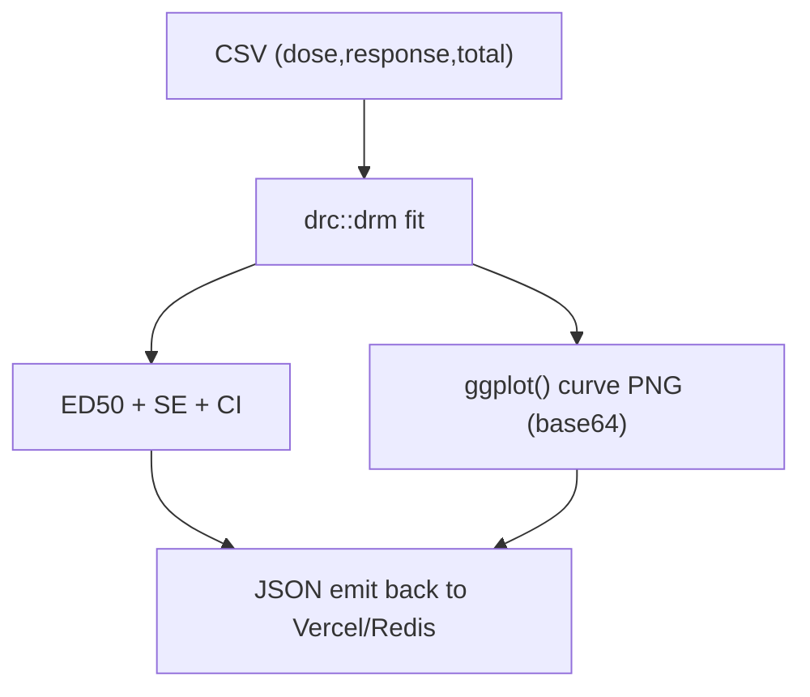
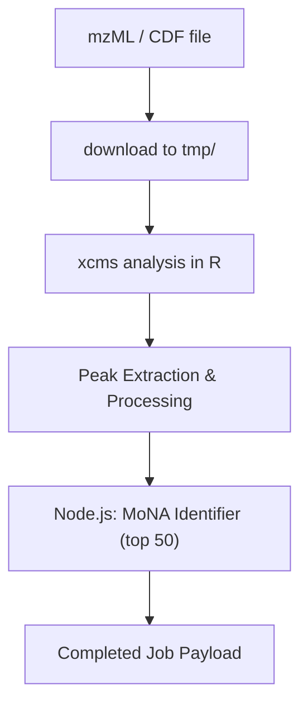
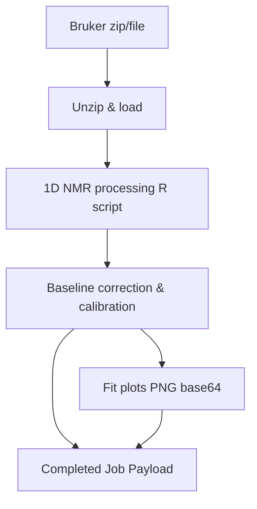
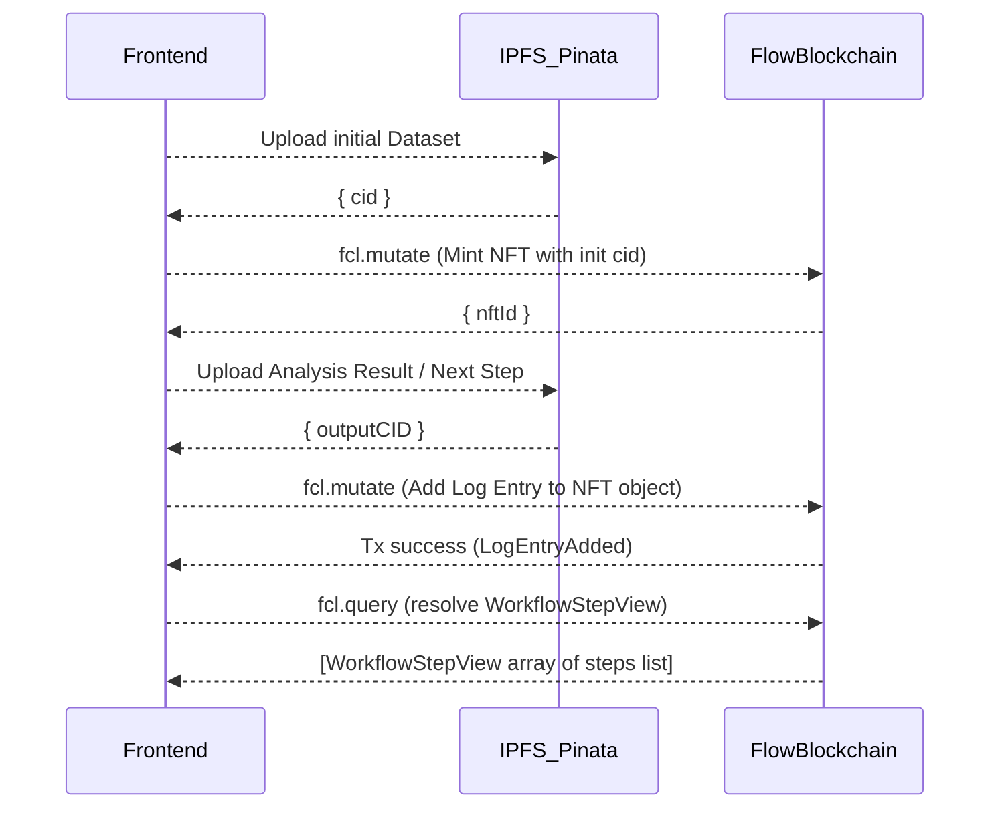

# KintaGen – Lab‑Assistant AI

**Focus:** biology / science workflows, IPFS hot‑storage (Pinata/Synapse), asynchronous job queues (Vercel/Redis/QStash), Nostr NIP-44 decentralized profiles and encryption, Flow Cadence Logs using the power of blockchain and NFTs

---

## Why KintaGen?

Modern life-science labs generate terabytes of high-value data—GC-MS chromatograms, NMR spectra, and mountains of supplemental PDFs. Managing this data is a significant challenge:

*   **Insecure & Ephemeral Sharing:** Critical data is shared via email or temporary links, leading to version control chaos (`Final_v4_reviewed_REALLYFINAL.csv`) and lost files.
*   **Lack of Reproducibility:** It's nearly impossible to prove which script or dataset produced a result six months ago, hindering validation and FAIR compliance.
*   **Data Silos & Security Risks:** Valuable intellectual property is often siloed, difficult to search, and at risk of being exposed before publication or patent filing.

KintaGen solves these challenges by integrating three core decentralized technologies:

| Technological Pillar | Core Capability | The Lab Benefit |
| :--- | :--- | :--- |
| **IPFS Storage (Pinata/Synapse)** | ⚡ **Fast & Decentralized Downloads.** All data is stored on decentralized networks and served globally via Pinata. | Share multi-gigabyte datasets, like GC-MS bundles or raw datasets, as easily as a web link—no more shipping hard drives. |
| **Nostr Identities & NIP-44** | 🔐 **Decentralized Profiles & Encryption.** Files are encrypted client-side securely linking private data to public on-chain provenance. | Securely collaborate on pre-publication data with partner labs without giving up ownership or exposing sensitive IP, while maintaining a portable researcher profile. |
| **Flow (Cadence) Logbook** | 📜 **Verifiable Audit Trails.** Every analysis step (the agent used, timestamp, output CID) is appended to a project-specific **Flow Cadence NFT**, creating an immutable history. | Create a tamper-proof log for any project, ensuring reproducibility and simplifying compliance for grant reporting. |

On top of this robust data foundation, Kintagen layers a suite of AI and analysis services (powered by Vercel serverless, Redis, and QStash), transforming it into an autonomous research co-pilot that can:

- [✅] **Extract Metadata:** Automatically parse titles, authors, and keywords from scientific papers.
- [✅] **Run Analyses:** Execute complex calculations like LD50 dose-response curves, GC-MS metabolomics, and NMR deconvolution on demand via specialized asynchronous R-workers.
- [✅] **Answer Questions:** Perform Retrieval-Augmented Generation (RAG) on your project's documents to answer complex, domain-specific questions.

Every output is pinned back to IPFS (via Pinata or SynapseSDK), ensuring that results are immediately available for downstream agents or external collaborators.

---

## 1. Data Lifecycle Overview
| Stage                           | Implementation in repo                                                                                                                                                                                                                               | Storage target                               |
| :------------------------------ | :--------------------------------------------------------------------------------------------------------------------------------------------------------------------------------------------------------------------------------------------------- | :------------------------------------------- |
| **Upload → (optional) Encrypt** | Front-end posts to SynapseSDK/Pinata. File is streamed to IPFS. If encrypted, the browser uses **Nostr NIP-44** to wrap the file; the key is securely managed on the client side utilizing Nostr decentralized profiles. | IPFS via Pinata/Synapse |
| **Metadata capture**            | Application extracts metadata and captures analytical output hashes, linking them back to decentralized data structures and IPFS CIDs. | Storage & Application State |
| **Agent workflows**             | R-based serverless async agents run LD₅₀ / GC-MS / NMR etc.; artifacts are saved locally in the processing server, heavy files are processed, and output data like plots are saved on IPFS with their CIDs logged. | IPFS (heavy artefacts) + Blockchain Flow log |
| **User access**                 | React app lists data; Nostr integration decrypts data locally, checking keys in browser; provenance timeline pulled from the project’s **Flow NFT** via Cadence scripts.                                                                                           | Browser cache & Decentralized Node |

---

## 2. Agent Catalogue

| Agent slug            | Status      | Runtime                                         | API / Entry-point        | Purpose (one-liner)                                                                             | Typical inputs                                  | Heavy outputs (IPFS)                                       |
| --------------------- | ----------- | ----------------------------------------------- | ------------------------ | ----------------------------------------------------------------------------------------------- | ----------------------------------------------- | ------------------------------------------------------------ |
| **`ld50-dose`**       | ✅ Live      | **Rscript** (`scripts/drc_analysis.R`)          | `POST /process-job` (kintagen-r-api) | Classical LD₅₀ / ED₅₀ dose-response modelling with **drc** → JSON + plot base64. | CSV (`dose, response, total`) or sample data    | Plot PNG representation                               |
| **`gcms-xcms`**       | ✅ Live      | **Rscript** (`scripts/xcms_analysis.R`)         | `POST /process-job` (kintagen-r-api) | Full untargeted GC-MS pipeline using **xcms**. Includes peak peak finding and retention alignment. | Directory of `mzML / CDF` (zipped)  | Stat data & intermediate results |
| **`nmr1d`**           | ✅ Live      | **Rscript** (`scripts/nmr1d_analysis.R`)        | `POST /process-job` (kintagen-r-api) | Quantitative 1H-NMR data processing, plotting, baseline correction and analysis. | Bruker dataset / raw FID files | Processed JSON & calibration/zoom plots |
| **`MoNA Identifier`** | ✅ Live      | **Node (fetch)** (`server.js` identifying peaks)  | Internal to `process-job` | Identifies single GC-MS peaks against the MoNA similarity search API. | MS Spectrum string                       | None (JSON hit and compound records)                                            |

*(Note: Legacy theoretical pipelines such as 'bio-extractor', 'spectra-indexer', 'genome-annot', etc. can be created following this same async Vercel Worker paradigm).*

---

### 2.1. `ld50-dose` – Detailed Design

```mermaid
graph TD
    L1["CSV (dose,response,total)"] --> L2["drc::drm fit"]
    L2 --> L3["ED50 + SE + CI"]
    L2 --> L4["ggplot() curve PNG (base64)"]
    L3 & L4 --> L5[JSON emit back to Vercel/Redis]
```

**Goal:** Compute LD₅₀ / ED₅₀ with confidence intervals.

**Pipeline Steps:**

1.  Worker fetches input CSV via URLs.
2.  Fit two-parameter log-logistic model (LL.2) with `drc`.
3.  `ED(model, 50)` → estimate + SE + 95 % CI.
4.  Plot curve + data; encode PNG → base64.
5.  Emit JSON, job status updated back to task queue.

**Outputs:**

*   `ld50_estimate`, `standard_error`, `ci_lower`, `ci_upper`.
*   `plot_b64`.

---

### 2.2. `gcms-xcms` – Detailed Design

```mermaid
graph TD
    X1[mzML / CDF file] --> X2["download to tmp/"]
    X2 --> X3[xcms analysis in R]
    X3 --> X4[Peak Extraction & Processing]
    X4 --> X5["Node.js: MoNA Identifier (top 50)"]
    X5 --> X6[Completed Job Payload]
```

**Goal:** Untargeted GC-MS analysis integrated with MoNA ID.

**Pipeline Steps:**

1.  Worker downloads the `mzML` target to local tmp storage.
2.  Applies initial `xcms` processing via R.
3.  Returns top spectra data.
4.  Node worker intercepts result and runs `identifySinglePeak` via MoNA limit=50.
5.  Updates job queue with merged spectra and compound hit database.

**Outputs:**

*   `top_spectra_data`, `library_matches` (JSON match from MoNA lab similarity search).

---

### 2.3. `nmr1d` – Detailed Design

```mermaid
graph TD
    N1[Bruker zip/file] --> N2[Unzip & load]
    N2 --> N3[1D NMR processing R script]
    N3 --> N4[Baseline correction & calibration]
    N4 --> N5[Fit plots PNG base64]
    N4 & N5 --> N6[Completed Job Payload]
```

**Goal:** Processing 1H-NMR data.

**Pipeline Steps:**

1.  Ingest Bruker raw directory/zip.
2.  Run native R pipeline to process FID to spectra, auto phase & baseline.
3.  Plot raw vs fitted; emit plot PNG encoded to base64.
4.  Emit JSON with plots `plot_b64` and `residual_zoom_plot_b64`.

**Outputs:**

*   Data object representing standard NMR spectra characteristics.
*   PNG data strings.

---

## 3. Flow NFT Logbook – How It Works 💡

The KintaGen backend can mint a unique NFT on the Flow blockchain to serve as an immutable "logbook" for a research project. This provides a verifiable, on-chain audit trail of all major data processing and analysis steps.

| Role | Details |
| :--- | :--- |
| **Purpose** | Every project gets **one on-chain “logbook” NFT**. It stores an immutable timeline of data-science workflow steps. |
| **Standard** | Implements `NonFungibleToken`, adds `ViewResolver` + `MetadataViews` so wallets & dApps can read the story without extra code. |
| **Custom View** | `WorkflowStepView` → array of objects `{stepNumber, agent, action, resultCID, timestamp}` – perfect for timelines in the UI. |
| **Log Entries** | A project allows subsequent updates extending the logbook array list inside the NFT resource securely on-chain. |
| **Integration** | Managed via Vercel integration and frontend `@onflow/fcl` passing the appropriate Cadence scripts/transactions. |

### Lifecycle & Sequence

The interaction between the frontend and Flow blockchain allows seamless provenance validation.

```mermaid
sequenceDiagram
    participant Frontend
    participant IPFS_Pinata
    participant FlowBlockchain

    Frontend-->>IPFS_Pinata: Upload initial Dataset
    IPFS_Pinata-->>Frontend: { cid }

    Frontend-->>FlowBlockchain: fcl.mutate (Mint NFT with init cid)
    FlowBlockchain-->>Frontend: { nftId }
    
    Frontend-->>IPFS_Pinata: Upload Analysis Result / Next Step
    IPFS_Pinata-->>Frontend: { outputCID }

    Frontend-->>FlowBlockchain: fcl.mutate (Add Log Entry to NFT object)
    FlowBlockchain-->>Frontend: Tx success (LogEntryAdded)
    
    Frontend-->>FlowBlockchain: fcl.query (resolve WorkflowStepView)
    FlowBlockchain-->>Frontend: [WorkflowStepView array of steps list]
```

*   **Mint:** The Flow transactions handle minting a new project directly leveraging Cadence scripts. The NFT is permanently assigned.
*   **Add Log Entry:** Every analysis or pipeline run triggers a flow mutation `NFT.addLogEntry()`, keeping track of which agent was invoked, preserving the output CID or input hashes.
*   **Read Story:** The client seamlessly resolves `WorkflowStepView` out of the given NFT id. The React components render a clean vertical timeline of the whole lifecycle of the scientific experiment.

---

## 📦 Code-base map

| Layer | Directory in Repository | Focus |
| :--- | :--- | :--- |
| **Frontend** (React + Vite) | `kintagen-vite-app` | React application, UI routing, local Nostr identity, Lit Protocol legacy traces, Vercel Serverless API interactions, and `@onflow/fcl` hooks. |
| **R API Async Worker** (Node + Express) | `kintagen-r-api` | Asynchronous worker endpoint (`/process-job`) that downloads data and spawns `xcms`, `drc`, and `nmr1d` processing R scripts. Submits success parameters back to Vercel/Qstash statuses. |
| **Flow Cadence Contracts** | `flow-nft-log` | On-chain Cadence business logic, containing `PublicKintaGenNFTv6.cdc`, basic transaction runners, and scripts for pulling logs dynamically. |

