# KintaGen – Lab‑Assistant AI

**Focus:** biology / science workflows, FilCDN hot‑storage, Mosaic AI agents, optional Flow NFT‑gated decryption, Flow Cadence Logs using the power of blockchain and NFTs

---

## Why KintaGen?

Modern life-science labs generate terabytes of high-value data—GC-MS chromatograms, NMR spectra, and mountains of supplemental PDFs. Managing this data is a significant challenge:

*   **Insecure & Ephemeral Sharing:** Critical data is shared via email or temporary links, leading to version control chaos (`Final_v4_reviewed_REALLYFINAL.csv`) and lost files.
*   **Lack of Reproducibility:** It's nearly impossible to prove which script or dataset produced a result six months ago, hindering validation and FAIR compliance.
*   **Data Silos & Security Risks:** Valuable intellectual property is often siloed, difficult to search, and at risk of being exposed before publication or patent filing.

KintaGen solves these challenges by integrating three core decentralized technologies:

| Technological Pillar | Core Capability | The Lab Benefit |
| :--- | :--- | :--- |
| **Filecoin + FilCDN** | ⚡ **Sub-second IPFS Downloads.** All data is stored on Filecoin and served globally via the FilCDN hot-storage cache. | Share multi-gigabyte datasets, like GC-MS bundles or genome assemblies, as easily as a web link—no more shipping hard drives. |
| **Flow EVM + Lit Protocol** | 🔐 **On-Chain Access Control.** Files are AES-encrypted in-browser. A **Flow EVM NFT** acts as a transferable key; only the wallet holding the NFT can grant decryption permissions. | Securely collaborate on pre-publication data with partner labs without giving up ownership or exposing sensitive IP. |
| **Flow (Cadence) Logbook** | 📜 **Verifiable Audit Trails.** Every analysis step (the agent used, timestamp, output CID) is appended to a project-specific **Cadence NFT**, creating an immutable history. | Create a tamper-proof log for any project, ensuring reproducibility and simplifying compliance for grant reporting. |

On top of this robust data foundation, Kintagen layers a suite of AI services, transforming it into an autonomous research co-pilot that can:

- [✅] **Extract Metadata:** Automatically parse titles, authors, and keywords from scientific papers.
- [✅] **Run Analyses:** Execute complex calculations like LD50 dose-response curves and GC-MS metabolomics on demand.
- [✅] **Answer Questions:** Perform Retrieval-Augmented Generation (RAG) on your project's documents to answer complex, domain-specific questions.

Every output is pinned back to Filecoin, ensuring that results are immediately available at CDN speed for downstream agents or external collaborators.

---

## 1. Data Lifecycle Overview
| Stage                           | Implementation in repo                                                                                                                                                                                                                               | Storage target                               |
| :------------------------------ | :--------------------------------------------------------------------------------------------------------------------------------------------------------------------------------------------------------------------------------------------------- | :------------------------------------------- |
| **Upload → (optional) Encrypt** | Front-end posts to **`/api/upload`**. File is streamed to Filecoin through **Synapse SDK**. If “Encrypt” is checked, the browser uses **Lit Protocol** to wrap the file; initial decryptor = uploader’s EOA and an **ERC-1155 key** (AccessManager). | Filecoin proof-set, hot-cached on **FilCDN** |
| **Metadata capture**            | API extracts / receives metadata and inserts into **Postgres** tables (`paper`, `experiment`, `analysis`, …).                                                                                                                                        | Postgres (Docker)                            |
| **Agent workflows**             | R or Mosaic agents run extraction / LD₅₀ / GC-MS etc.; large artefacts are pinned back to FilCDN and their CIDs logged in Postgres.                                                                                                                  | FilCDN (heavy artefacts) + Postgres row      |
| **User access**                 | React app lists data via **`/api/data/:type`**; Lit checks ERC-1155 key → decrypts in browser; provenance timeline pulled from the project’s **Flow NFT**.                                                                                           | Browser cache                                |


---

## 2. Data Model (suggested v0.1)


---

## 3. Agent Catalogue

| Agent slug            | Status      | Runtime                                         | API / Entry-point        | Purpose (one-liner)                                                                             | Typical inputs                                  | Heavy outputs (FilCDN)                                       |
| --------------------- | ----------- | ----------------------------------------------- | ------------------------ | ----------------------------------------------------------------------------------------------- | ----------------------------------------------- | ------------------------------------------------------------ |
| **`ld50-dose`**       | ✅ Live      | **Rscript** (`scripts/ld50_analysis.R`)         | `POST /api/analyze-ld50` | Classical LD₅₀ / ED₅₀ dose-response modelling with **drc** → JSON + plot.                       | CSV (`dose, response, total`) or sample data    | `bafy…ld50_plot.png` (≈ 30 kB)                               |
| **`gcms-xcms`**       | ✅ Live      | **Rscript** (`scripts/xcms_analysis.R`)         | `POST /api/analyze-gcms` | Full untargeted GC-MS pipeline (centroid → PCA → volcano) using **xcms + MSnbase**.             | Directory of `mzML/ mzXML / CDF` + metadata CSV | PCA & volcano PNGs, stats TSV, peak map (all base64 in JSON) |
| **`nmr-batman`**      | △ Prototype | **Rscript** (`scripts/run_batman.R`)            | `POST /api/analyze-nmr`  | Quantitative 1H-NMR deconvolution via **BATMAN**; API handler wired but script needs polishing. | Bruker folder / raw FID                         | Result matrix CSV, plot PNG                                  |
| **`qa-chat`**         | ✅ Live      | **Node** (`chat.controller.js`)                 | `POST /api/chat`         | Retrieval-augmented Q\&A: Mosaic → Exa → OpenAI; cites CIDs in answers.                         | User prompt + Postgres docs                     | None (text reply)                                            |
| **`data-uploader`**   | ✅ Live      | **Node + Synapse SDK** (`upload.controller.js`) | `POST /api/upload`       | Streams any file to Filecoin, optional Lit encryption & ERC-1155 key mint.                      | File buffer                                     | CommP / CID (hot-cached on FilCDN)                           |
| **`bio-extractor`**   | ⏳ Planned   | Python + R                                      | —                        | Parse PDFs → chemical entities (SMILES) TSV.                                                    | Paper rows                                      | `bafy…compounds.tsv`                                         |
| **`spectra-indexer`** | ⏳ Planned   | R                                               | —                        | Build DuckDB peak index for NMR / MS / IR spectra.                                              | Spectrum rows                                   | `bafy…peak_index.duckdb`                                     |
| **`genome-annot`**    | ⏳ Planned   | R                                               | —                        | ORF + functional annotation of genomes (GFF3 + FAA).                                            | Genome FASTA                                    | `bafy…genome_annot.gff3`, `bafy…proteins.faa`                |
| **`data-publisher`**  | ⏳ Planned   | Node                                            | —                        | Batch heavy artefacts, tar & upload with `--cdn`, broadcast CID list.                           | Intermediate files > 10 MB                      | `published.log`, tarballs                                    |


---
Of course. I've taken the raw text and reformatted it into a clean, well-structured markdown section. I've corrected the heading levels, formatted the mermaid and yaml code blocks, and used lists and bolding to improve readability, matching the style of a high-quality README.

Here is the properly formatted content:

---

### 3.1. `bio-extractor` – Detailed Design


**Goal:** Convert raw biology PDFs into structured chemical-entity tables.

**Pipeline Steps:**

1.  Load PDF (FilCDN hot-cached) → raw bytes.
2.  Extract text + images with `pdfminer.six`.
3.  R bridge to Bioconductor:
    *   `Rcqp`, `tm` for chemical NER.
    *   `ChemmineR::extractSmiles()` → canonical SMILES.
4.  (Optional) plant-compound enrichment: if metadata keywords include a Latin species name, call KEGGREST for that species and merge.
5.  Deduplicate, score confidence → TSV (`compound`, `smiles`, `source_cid`, `confidence`).

**Outputs:**

*   `bafy…compounds.tsv` — CDN-enabled.
*   `extractor_receipt.json` — SHA-256 of input PDF, row count.

**Mosaic Agent YAML (template):**
```yaml
name: bio-extractor
image: ghcr.io/kintagen/bio-extractor:v0.1
memory: 2G
command: ["python", "extract.py", "--input", "%INPUT_PDF%"]
keywords: [chemistry, bioconductor, rdkit]
tags: [extract, compounds]
externalId: pdf_to_compound_agent
```

**Future Ideas:**
*   Add LC-MS peak-matching to pair extracted compounds with real spectra.
*   Publish enriched TSVs to Reppo Solver cache for reuse.

---

### 3.2. `spectra-indexer` – Detailed Design


**Goal:** Build a searchable peak index from NMR, IR, and MS spectra.

**Pipeline Steps:**

1.  Download spectrum from FilCDN.
2.  Read & normalise:
    *   NMR: `ChemoSpec::readBrukerSpectra()` + auto phase & baseline.
    *   IR: `readJDX()` + interpolate.
    *   MS: `MSnbase::readMSData()`; centroid.
3.  Peak picking (`ChemoSpec`, `hyperSpec`, `MALDIquant`).
4.  Filter by S/N threshold (`SNR_MIN`).
5.  Write Parquet rows (`spectrum_cid`, `technique`, `x_value`, `intensity`).
6.  Append to DuckDB; `VACUUM` daily.
7.  Upload peak DB to FilCDN.

**Outputs:**

*   `bafy…peak_index.duckdb` (≈ 200 MB).
*   `indexer_receipt.json` — input SHA-256, rows added.

**Mosaic Agent YAML (template):**
```yaml
name: spectra-indexer
image: ghcr.io/kintagen/spectra-indexer-r:v0.1
memory: 3G
command: ["Rscript", "index.R", "--input", "%INPUT_SPECTRUM%", "--db", "/outputs/peak_index.duckdb"]
keywords: [nmr, ms, bioconductor, R]
tags: [index, spectra]
externalId: spectra_peak_agent_r
```

**Future Ideas:**
*   Auto-classify NMR peaks (aromatic, aliphatic) with `PAinT`.
*   Export PCA coordinates for clustering visualisation.

---

### 3.3. `genome-annot` – Detailed Design


**Goal:** Annotate raw genome assemblies and emit standard GFF3 + FAA.

**Pipeline Steps:**

1.  Download FASTA from FilCDN; drop contigs < 500 bp.
2.  (Optional) Repeat-masking.
3.  ORF prediction (`DECIPHER::FindORFs`).
4.  Functional annotation via `AnnotationHub` RefSeq BLAST.
5.  Export `genome_annot.gff3` and `proteins.faa`.
6.  Tar + gzip, upload to FilCDN.

**Outputs:**

*   `bafy…genome_annot.gff3`
*   `bafy…proteins.faa`
*   `annot_receipt.json` — input hash, gene count.

**Mosaic Agent YAML (template):**
```yaml
name: genome-annot
image: ghcr.io/kintagen/genome-annot-r:v0.1
memory: 4G
command: ["Rscript", "annot.R", "--input", "%INPUT_GENOME%", "--out", "/outputs"]
keywords: [genome, annotation, bioconductor, R]
tags: [annotate, gff3]
externalId: genome_annot_agent_r
```

**Future Ideas:**
*   Integrate `eggNOG-mapper` wrapper for orthology.
*   Auto-generate pathway heat-maps and pin as PNG.

---

### 3.4. `qa-answer` – Detailed Design


**Goal:** Provide retrieval-augmented answers for biology questions.

**Pipeline Steps:**

1.  Use Mosaic LLM to draft 10 diverse search queries.
2.  Fetch top-10 results per query with Exa; slice 750 chars each.
3.  Concatenate context; inject into OpenAI completion with citation template.
4.  Return answer text + inline `[#]` footnotes.

**Outputs:**

*   Chat reply streamed to front-end.
*   (Planned) `answer.txt` & `citations.json` pinned when user clicks “Save”.

**Mosaic Agent YAML (template):**
```yaml
name: qa-answer
image: ghcr.io/kintagen/qa-answer-node:v0.1
memory: 512M
command: ["node", "qa.js"]
keywords: [rag, openai, search]
tags: [qa]
externalId: qa_agent_node
```

**Future Ideas:**
*   Local Llama-3 fallback with `llama.cpp`.
*   Vector-DB caching (`pgvector`) for search snippets.

---

### 3.5. `data-publisher` – Detailed Design


**Goal:** Batch-upload heavy artefacts to FilCDN and announce their CIDs.

**Pipeline Steps:**

1.  Scan Postgres for artefacts > 10 MB missing `cdn_url`.
2.  Tar + gzip bundles (max 4 GB each).
3.  `storacha upload --cdn --pdp=2d` (or Synapse SDK).
4.  Update analysis / spectrum rows with CDN URL.
5.  Broadcast Reppo RFD `{service:"download", cidList:[…]}`.

**Outputs:**

*   `published.log` — list of new CIDs.
*   `publisher_receipt.json` — map tarball → CID.

**Mosaic Agent YAML (template):**
```yaml
name: data-publisher
image: ghcr.io/kintagen/data-publisher-node:v0.1
memory: 512M
command: ["node", "publish.js"]
keywords: [filcdn, batch]
tags: [publish]
externalId: publisher_agent_node
```

**Future Ideas:**
*   Incremental hashing to skip unchanged files.
*   Email / Slack webhook when new bundle is published.

---

### 3.6. `ld50-dose` – Detailed Design


**Goal:** Compute LD₅₀ / ED₅₀ with confidence intervals.

**Pipeline Steps:**

1.  Parse CSV (or sample).
2.  Fit two-parameter log-logistic model (LL.2) with `drc`.
3.  `ED(model, 50)` → estimate + SE + 95 % CI.
4.  Plot curve + data; encode PNG → base64.
5.  Emit JSON.

**Outputs:**

*   `ld50_estimate`, `standard_error`, `ci_lower`, `ci_upper`.
*   `plot_b64`.

**Mosaic Agent YAML (template):**
```yaml
name: ld50-dose
image: ghcr.io/kintagen/ld50-dose-r:v0.1
memory: 256M
command: ["Rscript", "ld50_analysis.R", "%CSV_PATH%"]
keywords: [toxicology, drc, R]
tags: [ld50]
externalId: ld50_agent_r
```

**Future Ideas:**
*   Hill or probit models.
*   Batch-mode for multi-compound plates.

---

### 3.7. `gcms-xcms` – Detailed Design

```mermaid
graph TD
    X1[mzML / CDF dir] --> X2[xcms::readMSData]
    X2 --> X3[Centroid & Align]
    X3 --> X4[findChromPeaks]
    X4 --> X5[fillChromPeaks]
    X5 --> X6[Camera grouping]
    X6 --> X7[Stats table]
    X6 --> X8[PCA PNG]
    X6 --> X9[Volcano PNG]
    X6 --> X10[RT × m/z map PNG]
    X7 & X8 & X9 & X10 --> X11[JSON assemble]
```



**Goal:** Untargeted GC-MS differential analysis.

**Pipeline Steps:**

1.  Load data (`readMSData`).
2.  Centroid, RT alignment, peak detection (`xcms`).
3.  Group isotopes/adducts (`CAMERA`).
4.  Compute log₂ FC, p-value, FDR.
5.  Produce PCA, volcano, RT–m/z plots.
6.  Encode PNGs → base64.

**Outputs:**

*   `stats_table` (array).
*   `pca_plot_b64`, `volcano_plot_b64`, `metabolite_map_b64`.
*   `top_feature_plots` (per-feature EIC + spectrum).

**Mosaic Agent YAML (template):**
```yaml
name: gcms-xcms
image: ghcr.io/kintagen/gcms-xcms-r:v0.1
memory: 3G
command: ["Rscript", "xcms_analysis.R", "%DATA_DIR%", "%PHENO_CSV%"]
keywords: [metabolomics, xcms, R]
tags: [gcms]
externalId: gcms_agent_r
```

**Future Ideas:**
*   `CAMERA` annotation to HMDB IDs.
*   Fold-change threshold auto-tuning.

---

### 3.8. `nmr-batman` – Detailed Design


**Goal:** Quantitative ¹H-NMR deconvolution.

**Pipeline Steps:**

1.  Ingest Bruker directory; auto phase & baseline.
2.  Run BATMAN MCMC fit with compound library.
3.  Output peak table (ppm, area, compound).
4.  Plot raw vs fitted; encode PNG.
5.  Emit JSON.

**Outputs:**

*   `peak_table` (data.frame).
*   `fit_plot_b64`.

**Mosaic Agent YAML (template):**
```yaml
name: nmr-batman
image: ghcr.io/kintagen/nmr-batman-r:v0.1
memory: 2G
command: ["Rscript", "batman_analysis.R", "%FID_PATH%"]
keywords: [nmr, batman, R]
tags: [nmr]
externalId: nmr_batman_agent_r
```

**Future Ideas:**
*   Auto-library generation from HMDB.
*   Multi-sample batching with shared variance priors.
---

## 5. Flow NFT for Decrypt

**Idea:** Owner mints `DatasetAccess` NFT on Flow; its resource stores `cid` + AES key hash. Lit’s JS client checks NFT ownership, retrieves key.

```solidity
// SPDX-License-Identifier: MIT
pragma solidity ^0.8.20;

import "@openzeppelin/contracts/token/ERC1155/ERC1155.sol";

/// @title AccessManager
/// @notice A permissionless ERC1155 contract for creating and managing access keys for token-gated content.
/// Any user can create a new key type (tokenId) for their content.
contract AccessManager is ERC1155 {
    // A counter to ensure each new key has a unique tokenId.
    uint256 private _nextTokenId;

    // Mapping from a tokenId to the name of the content it gates.
    // Making it public creates an automatic getter function.
    mapping(uint256 => string) public contentNames;

    // Event to announce the creation of a new content key.
    event KeyCreated(uint256 indexed tokenId, string name, address indexed creator);

    constructor() ERC1155("ipfs://") {} // URI can be updated later if needed.

    /// @notice Creates a new type of key for a new piece of content.
    /// @dev This function is public and can be called by anyone.
    /// It creates a new tokenId, associates it with a name, and mints one key to the caller.
    /// @param _name A descriptive name for the content being gated (e.g., "My Secret Document").
    /// @return tokenId The new ID representing the key for the content.
    function createKey(string memory _name) external returns (uint256 tokenId) {
        tokenId = _nextTokenId;
        _nextTokenId++;

        // Store the name of the content associated with this new key.
        contentNames[tokenId] = _name;

        // The caller (msg.sender) is the creator and automatically gets the first key.
        // They are now the de-facto "owner" of this content key.
        _mint(msg.sender, tokenId, 1, "");

        // Announce that a new key has been created.
        emit KeyCreated(tokenId, _name, msg.sender);
    }

    /// @notice Grants a key for a specific content piece to a user.
    /// @dev Only the current holder of a key can grant a new one to someone else.
    /// This ensures that only the original creator (or someone they gave a key to) can share access.
    /// @param _to The address of the user to receive the key.
    /// @param _tokenId The ID of the key to grant.
    function grantAccess(address _to, uint256 _tokenId) external {
        // require(condition, "error message") is a check. If false, the transaction fails.
        require(balanceOf(msg.sender, _tokenId) > 0, "AccessManager: You must hold a key to grant one.");
        require(_tokenId < _nextTokenId, "AccessManager: Invalid tokenId.");
        
        _mint(_to, _tokenId, 1, "");
    }

    /// @notice A user can burn their own key if they no longer want access.
    /// @param _tokenId The ID of the key to burn.
    function burnMyKey(uint256 _tokenId) external {
        require(balanceOf(msg.sender, _tokenId) > 0, "AccessManager: You do not hold this key.");
        _burn(msg.sender, _tokenId, 1);
    }

    /// @notice Returns the total number of key types that have been created.
    /// @dev Useful for frontends to iterate and display all content items.
    /// @return The total count of tokenIds.
    function getTotalKeys() external view returns (uint256) {
        return _nextTokenId;
    }
}
```

---

## 4. Flow NFT Logbook – How It Works 💡

The KintaGen backend can mint a unique NFT on the Flow blockchain to serve as an immutable "logbook" for a research project. This provides a verifiable, on-chain audit trail of all major data processing and analysis steps.

| Role | Details |
| :--- | :--- |
| **Purpose** | Every project gets **one on-chain “logbook” NFT**. It stores an immutable timeline of data-science workflow steps. |
| **Standard** | Implements `NonFungibleToken`, adds `ViewResolver` + `MetadataViews` so wallets & dApps can read the story without extra code. |
| **Custom View** | `WorkflowStepView` → array of objects `{stepNumber, agent, action, resultCID, timestamp}` – perfect for timelines in the UI. |
| **Events** | `ContractInitialized`, `Minted(id, agent, runHash)`, `LogEntryAdded(nftID, agent, outputCID)` – lets indexers follow progress. |
| **Storage Paths** | `/storage/kintagenNFTCollection`, `/public/kintagenNFTCollection`, `/storage/kintagenNFTMinter` (admin-only). |

### Lifecycle & Sequence

The interaction between the frontend, backend, and the Flow blockchain follows a clear sequence for creating and updating the logbook.

```mermaid
sequenceDiagram
    participant Frontend
    participant API
    participant FlowSvc
    participant KintaGenNFT

    Frontend-->>API: POST /projects (Create Project)
    API-->>Frontend: { project details }

    Frontend-->>API: POST /projects/{id}/mint
    API->>FlowSvc: mintProjectNFT(agent, outputCID, runHash)
    FlowSvc->>KintaGenNFT: Tx → Minter.mint()
    KintaGenNFT-->>FlowSvc: emit Minted(id,…)
    FlowSvc-->>API: { nftId }
    API-->>Frontend: { updated project with nftId }
    
    Frontend-->>API: POST /projects/{id}/log (e.g., after analysis)
    API->>FlowSvc: addLogEntry(nftId, ...)
    FlowSvc->>KintaGenNFT: Tx → NFT.addLogEntry()
    KintaGenNFT-->>FlowSvc: emit LogEntryAdded(...)
    
    Frontend-->>API: GET /nfts/{id}/story (View project details)
    API->>FlowSvc: script getWorkflowStory(id)
    FlowSvc-->>API: [WorkflowStepView…]
    API-->>Frontend: JSON timeline
```



*   **Mint:** The backend calls `mintProjectNFT` once a new project is created; the NFT is deposited into the service account’s collection.
*   **Add Log Entry:** Every analysis or pipeline run hits `POST /projects/{id}/log`, which triggers a Flow transaction that runs `NFT.addLogEntry()`.
*   **Read Story:** The REST endpoint `/nfts/:id/story` executes a Cadence script that resolves the `WorkflowStepView`; the React component `KintaGenWorkflowViewer` renders this as a vertical timeline.

### On-Chain Data Layout

The NFT itself stores the critical log data directly on-chain.

| Field | Stored in | Notes |
| :--- | :--- | :--- |
| `initialAgent` / `initialOutputCID` / `initialRunHash` | NFT resource | Immutable “genesis” commit. |
| `log` (array of `LogEntry`) | NFT resource | Each step: `agent`, `actionDescription`, `outputCID`, `timestamp`. |
| `WorkflowStepView` | derived view | Combines genesis (step 0) + every log entry. |

### Backend & Frontend Integration

The logic is split between the backend services and frontend components.

| File | Purpose |
| :--- | :--- |
| `src/services/flow.service.js` | Contains `mintProjectNFT()` & `addLogEntry()` transactions + P-256 signer. |
| `src/controllers/nft.controller.js` | Express endpoints `/nfts/:id/story` and `/projects/:projectId/log`. |
| `src/components/KintaGenWorkflowViewer.tsx` | React timeline that hits the story endpoint and displays steps. |
```cadence
//import "NonFungibleToken"
import "ViewResolver"
import "MetadataViews"

/**
*  KintaGenNFT Contract
*
*  This contract implements an NFT that functions as an immutable, on-chain 
*  logbook for KintaGen's data and agent workflows. It features a custom
*  `WorkflowStepView` to present the NFT's entire history as a structured,
*  human-readable story, perfect for visual display on a frontend.
*
*/
access(all) contract KintaGenNFT: NonFungibleToken {

    /* ─────────────── Standard Paths ─────────────── */
    access(all) let CollectionStoragePath: StoragePath
    access(all) let CollectionPublicPath : PublicPath
    access(all) let MinterStoragePath    : StoragePath

    /* ────────────────── Events ────────────────── */
    access(all) event LogEntryAdded(nftID: UInt64, agent: String, outputCID: String)
    access(all) event Minted(id: UInt64, agent: String, runHash: String)
    access(all) event ContractInitialized()

    /* ─────────────── Log Entry Struct ─────────────── */
    access(all) struct LogEntry {
        access(all) let agent: String
        access(all) let actionDescription: String
        access(all) let outputCID: String
        access(all) let timestamp: UFix64

        init(agent: String, actionDescription: String, outputCID: String) {
            self.agent = agent
            self.actionDescription = actionDescription
            self.outputCID = outputCID
            self.timestamp = getCurrentBlock().timestamp
        }
    }

    /* ─────────────── Custom View for Frontend Story ─────────────── */
    access(all) struct WorkflowStepView {
        access(all) let stepNumber: Int
        access(all) let agent: String
        access(all) let action: String
        access(all) let resultCID: String
        access(all) let timestamp: UFix64

        init(stepNumber: Int, agent: String, action: String, resultCID: String, timestamp: UFix64) {
            self.stepNumber = stepNumber
            self.agent = agent
            self.action = action
            self.resultCID = resultCID
            self.timestamp = timestamp
        }
    }

    /* ─────────────────── NFT Resource ─────────────────── */
    access(all) resource NFT: NonFungibleToken.NFT, ViewResolver.Resolver {
        access(all) let id: UInt64
        access(all) let initialAgent: String
        access(all) let initialOutputCID: String
        access(all) let initialRunHash: String
        access(all) let initialTimestamp: UFix64
        access(all) var log: [LogEntry]

        init(agent: String, outputCID: String, runHash: String) {
            self.id = self.uuid
            self.initialAgent = agent
            self.initialOutputCID = outputCID
            self.initialRunHash = runHash
            self.initialTimestamp = getCurrentBlock().timestamp
            self.log = []
            emit Minted(id: self.id, agent: self.initialAgent, runHash: self.initialRunHash)
        }

        access(all) fun addLogEntry(agent: String, actionDescription: String, outputCID: String) {
            let newEntry = LogEntry(agent: agent, actionDescription: actionDescription, outputCID: outputCID)
            self.log.append(newEntry)
            emit LogEntryAdded(nftID: self.id, agent: agent, outputCID: outputCID)
        }

        access(all) view fun getViews(): [Type] {
            return [
                Type<MetadataViews.Display>(),
                Type<MetadataViews.Traits>(),
                Type<MetadataViews.Serial>(),
                Type<KintaGenNFT.WorkflowStepView>()
            ]
        }

        access(all) fun resolveView(_ view: Type): AnyStruct? {
            switch view {
                case Type<MetadataViews.Display>():
                    var latestDescription = "Initial State: Created by ".concat(self.initialAgent)
                    var latestThumbnail = MetadataViews.IPFSFile(cid: self.initialOutputCID, path: nil)
                    if self.log.length > 0 {
                        let latestEntry = self.log[self.log.length - 1]
                        latestDescription = latestEntry.actionDescription
                        latestThumbnail = MetadataViews.IPFSFile(cid: latestEntry.outputCID, path: nil)
                    }
                    return MetadataViews.Display(name: "KintaGen Log #".concat(self.id.toString()), description: latestDescription, thumbnail: latestThumbnail)

                case Type<MetadataViews.Traits>():
                    var traits = [
                        MetadataViews.Trait(name: "Initial Agent", value: self.initialAgent, displayType: "String", rarity: nil),
                        MetadataViews.Trait(name: "Initial Run Hash", value: self.initialRunHash, displayType: "String", rarity: nil),
                        MetadataViews.Trait(name: "Log Entries", value: self.log.length, displayType: "Number", rarity: nil)
                    ]
                    if self.log.length > 0 {
                        let latestAgent = self.log[self.log.length - 1].agent
                        traits.append(MetadataViews.Trait(name: "Latest Agent", value: latestAgent, displayType: "String", rarity: nil))
                    }
                    return MetadataViews.Traits(traits)

                case Type<MetadataViews.Serial>():
                    return MetadataViews.Serial(self.id)

                case Type<KintaGenNFT.WorkflowStepView>():
                    let story: [WorkflowStepView] = []
                    story.append(
                        WorkflowStepView(
                            stepNumber: 0,
                            agent: self.initialAgent,
                            action: "Created initial data asset",
                            resultCID: self.initialOutputCID,
                            timestamp: self.initialTimestamp
                        )
                    )
                    var i = 0
                    while i < self.log.length {
                        let logEntry = self.log[i]
                        story.append(
                            WorkflowStepView(
                                stepNumber: i + 1,
                                agent: logEntry.agent,
                                action: logEntry.actionDescription,
                                resultCID: logEntry.outputCID,
                                timestamp: logEntry.timestamp
                            )
                        )
                        i = i + 1
                    }
                    return story
            }
            return nil
        }
        
        access(all) fun createEmptyCollection(): @{NonFungibleToken.Collection} {
            return <- KintaGenNFT.createEmptyCollection(nftType: Type<@KintaGenNFT.NFT>())
        }
    }

    /* ─────────────── Collection Resource ─────────────── */
    access(all) resource Collection: NonFungibleToken.Collection, ViewResolver.ResolverCollection {
        access(all) var ownedNFTs: @{UInt64: {NonFungibleToken.NFT}}
        
        init() {
            self.ownedNFTs <- {}
        }
        
        access(all) fun deposit(token: @{NonFungibleToken.NFT}) {
            let nft <- token as! @KintaGenNFT.NFT
            let old <- self.ownedNFTs[nft.id] <- nft
            destroy old
        }
        
        access(NonFungibleToken.Withdraw) fun withdraw(withdrawID: UInt64): @{NonFungibleToken.NFT} {
            let nft <- self.ownedNFTs.remove(key: withdrawID)
                ?? panic("NFT does not exist")
            return <-nft
        }
        
        access(all) view fun getIDs(): [UInt64] {
            return self.ownedNFTs.keys
        }
        
        access(all) view fun getLength(): Int {
            return self.ownedNFTs.length
        }
        
        access(all) view fun borrowNFT(_ id: UInt64): &{NonFungibleToken.NFT}? {
            return &self.ownedNFTs[id] as &{NonFungibleToken.NFT}?
        }

        // --- THIS IS THE FIXED, REFORMATTED FUNCTION ---
        access(all) view fun borrowViewResolver(id: UInt64): &{ViewResolver.Resolver}? {
            if let nft = &self.ownedNFTs[id] as &{NonFungibleToken.NFT}? {
                return nft as &{ViewResolver.Resolver}
            }
            return nil
        }
        
        access(all) view fun getSupportedNFTTypes(): {Type: Bool} {
            return { Type<@KintaGenNFT.NFT>(): true }
        }
        
        access(all) view fun isSupportedNFTType(type: Type): Bool {
            return type == Type<@KintaGenNFT.NFT>()
        }
        
        access(all) fun createEmptyCollection(): @{NonFungibleToken.Collection} {
            return <- KintaGenNFT.createEmptyCollection(nftType: Type<@KintaGenNFT.NFT>())
        }
    }

    /* ─────────────────── Minter Resource ─────────────────── */
    access(all) resource Minter {
        access(all) fun mint(agent: String, outputCID: String, runHash: String): @NFT {
            return <- create NFT(agent: agent, outputCID: outputCID, runHash: runHash)
        }
    }

    /* ─────────────────── Contract-Level Functions ─────────────────── */
    access(all) fun createEmptyCollection(nftType: Type): @{NonFungibleToken.Collection} {
        return <- create Collection()
    }
    
    access(all) view fun getContractViews(resourceType: Type?): [Type] {
        return [Type<MetadataViews.NFTCollectionData>(), Type<MetadataViews.NFTCollectionDisplay>()]
    }
    
    access(all) fun resolveContractView(resourceType: Type?, viewType: Type): AnyStruct? {
        switch viewType {
            case Type<MetadataViews.NFTCollectionData>():
                return MetadataViews.NFTCollectionData(
                    storagePath: self.CollectionStoragePath,
                    publicPath: self.CollectionPublicPath,
                    publicCollection: Type<&KintaGenNFT.Collection>(),
                    publicLinkedType: Type<&KintaGenNFT.Collection>(),
                    createEmptyCollectionFunction: (fun(): @{NonFungibleToken.Collection} {
                        return <- KintaGenNFT.createEmptyCollection(nftType: Type<@KintaGenNFT.NFT>())
                    })
                )
            case Type<MetadataViews.NFTCollectionDisplay>():
                let media = MetadataViews.Media(file: MetadataViews.IPFSFile(cid: "bafkreie6j2nehq5gpcjzymf5qj3txgxgm5xcg2gqzquthy2z2g44zbdvda", path: nil), mediaType: "image/png")
                return MetadataViews.NFTCollectionDisplay(
                    name: "KintaGen Workflow NFTs",
                    description: "NFTs that function as a permanent, on-chain logbook for KintaGen's data-science workflows.",
                    externalURL: MetadataViews.ExternalURL("https://kintagen.com"),
                    squareImage: media,
                    bannerImage: media,
                    socials: {}
                )
        }
        return nil
    }

    /* ─────────────── init ─────────────── */
    init() {
        self.CollectionStoragePath = /storage/kintagenNFTCollection
        self.CollectionPublicPath  = /public/kintagenNFTCollection
        self.MinterStoragePath     = /storage/kintagenNFTMinter
        
        self.account.storage.save(<- create Minter(), to: self.MinterStoragePath)
        self.account.storage.save(<- create Collection(), to: self.CollectionStoragePath)
        
        let cap = self.account.capabilities.storage.issue<&KintaGenNFT.Collection>(self.CollectionStoragePath)
        self.account.capabilities.publish(cap, at: self.CollectionPublicPath)
        
        emit ContractInitialized()
    }
}
```
---


